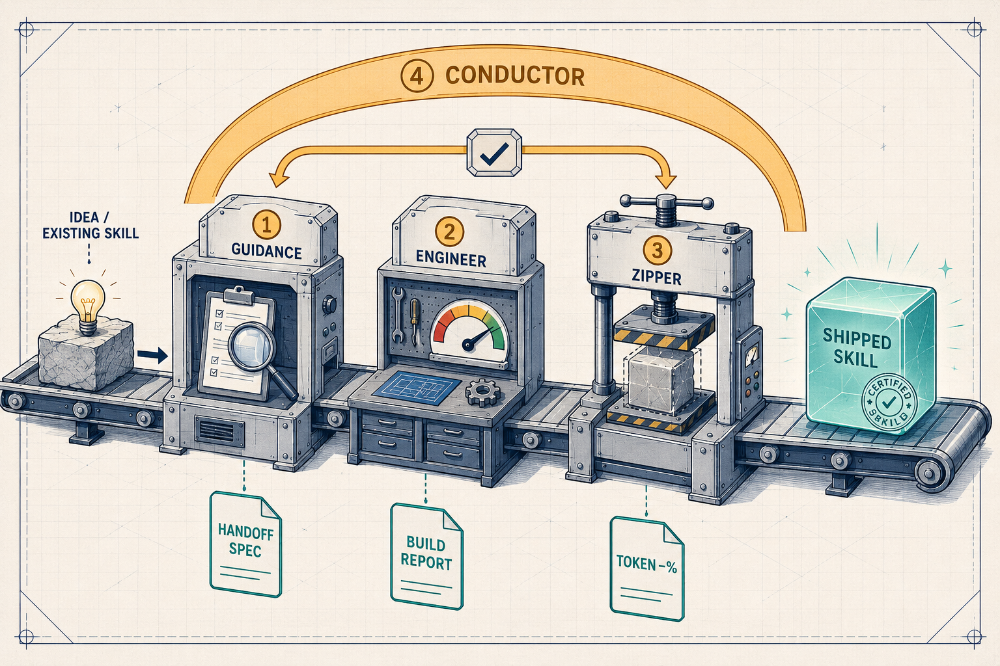

# Industrial-Grade Agent Skills


> Agent skills for Claude Code that ship with contracts, validators, and eval suites — and get broken by an independent judge before release, not just self-reported green.

[](LICENSE) · **English** · [简体中文](README.md)

Most agent skills are a prompt and a hope. These are built like software: each one has a deterministic
validator, a red-green eval loop, and an independent fresh-agent battery that *tries to break it*. Small,
sharply-scoped, bilingual (EN / 中文; several Chinese-first). Adapt them, make them your own.

## Skills at a glance

One line each — what every skill does. Full write-ups (with each skill's *edge*) are in [Reference](#reference) below.

**Product**
- **[album-review](skills/album-review/)** — One 10,000–15,000-字 Chinese 乐评 from an artist + album, source-traced across every musical dimension.
- **[hifi-review](skills/hifi-review/)** — Objective HiFi-gear evaluation: transducer signature from FR-vs-target, source-gear competence from measurements — every claim traced to evidence.
- **[course-study](skills/course-study/)** — Turns a course's materials into complete-coverage, Feynman-explained, exam-ready revision notes.
- **[fact-check](skills/fact-check/)** — A fast, citation-backed BLUF answer to a factual question, inside a hard ≤2-min (simple) / ≤5-min (complex) budget.
- **[humanizer-academic](skills/humanizer-academic/)** — Rewrites AI-generated serious prose (EN / ZH / mixed) in two modes (academic papers / serious popsci); abstain-first (leaves human-reading text alone), strips AI signals while keeping each genre's register.
- **[low-visibility-fix](skills/low-visibility-fix/)** — Audits field mobile UI (low light, glare, gloves) and hands back an implementer-ready fix-plan doc set; never edits the target (prove-or-flag: reports only what it can prove, flags the rest for judgment, never fabricates a default).
- **[mp-cli-sup](skills/mp-cli-sup/)** — Debugs a *live* WeChat Mini Program through the `vince-mp` CLI — one persistent session, stable element uids, camera-less scan.
- **[mp-groundline](skills/mp-groundline/)** — Migrates a WeChat Mini Program from Skyline to WebView, consistency-first, with a read-only scanner + a migration map (keeps workarounds, never reverts).

**Coding discipline** — auto-triggered as you build
- **[test-driven-development](skills/test-driven-development/)** — TDD for *non-trivial* behavior: a failing test first, the suite kept as a *living spec* of the current target.
- **[neat](skills/neat/)** — End-of-session knowledge-base cleanup: reconciles docs + cross-session agent memory against the code so nothing rots.
- **[loop-constructor](skills/loop-constructor/)** — Designs the engineered *loop* for a medium/large agent task — decomposed into gated sub-loops — and writes a runnable `.loop/` runbook.
- **[attacker](skills/attacker/)** — Attacks a product's *actual observable behavior* (or red-teams an idea/argument/plan): a fresh, TDD-independent subagent attacks within a declared scope and records only proven, reproducible breakages as attack records — gated by a deterministic validator; pairs with loop-constructor (attack→fix→re-attack).
- **[reorganize-logic](skills/reorganize-logic/)** — Rebuilds a project's design-contract layer from scratch (architecture + structure + interface definitions) with the code as the single source of truth, behind a strict gate.

**The skill-building pipeline** — skills that build skills
- **[skill-conductor](skills/skill-conductor/)** — Drives guidance → engineer → zipper end to end with anti-inflation final acceptance.
- **[skill-guidance](skills/skill-guidance/)** — Audits a skill/repo (scores, scopes, finds gaps) and emits a schema-validated handoff spec.
- **[skill-engineer](skills/skill-engineer/)** — Builds and tests a skill from that spec, red-green-refactor, with an independent battery.
- **[skill-zipper](skills/skill-zipper/)** — Restructures an existing skill for token efficiency, reliability, and trigger accuracy — losslessly.

## Quickstart

```bash
npx skills add VincentJiang06/skills        # pick which skills to install
```

Pulls straight from this repo (via [skills.sh](https://github.com/vercel-labs/skills)), auto-discovers every skill, and installs into `.claude/skills/` or `.agents/skills/`. Manual alternative: `cp -R skills/<name> ~/.claude/skills/` (or `<your-repo>/.claude/skills/` for project scope).

Then just ask — Claude Code auto-triggers from your request — or call `/<skill-name>` explicitly:

```
> is it true that the Eiffel Tower gets taller in summer?     # → fact-check
```

## Why these are different

Five principles, learned the hard way building every skill here.

### 1. Proof, not vibes
A skill you can't verify is a skill you can't trust. Each one ships a **deterministic validator**
(`check_review.py`, `check_answer.mjs`, `fact_lint.mjs`, …) and an eval suite, built test-first.
Benchmarked against 8 of the top public skill repos, this collection leads on machine-readable contracts and
deterministic proof.

### 2. The closed loop lies
A skill's own tests go green while it's still wrong — *green-but-wrong by default*. So every skill faces an
**independent fresh-agent battery, blind to its build rules**. It caught real bugs the self-tests missed in
*every* skill (5 in the humanizer, twice in company-background, four rounds in fact-check). The humanizer goes
further: success is scored by a blind judge, never by "count the patterns I deleted."

### 3. Accuracy over speed
Crude buckets and fixed enums mislabel every edge case — *"分三派还不如不分."* Skills classify from **rich
per-item descriptors + judgment at runtime**, not a hard taxonomy. The single deliberate exception is
`fact-check` (speed-first by design) — and even it is never confident-and-wrong.

### 4. Sharp scope, no creep
"More features = better" is a trap; extra machinery is friction, not value. Each skill does **one job well**.
course-study deliberately dropped quizzing, spaced-repetition, and Anki export to stay a clean revision tool.
Thin `SKILL.md`, progressive disclosure, low always-loaded cost.

### 5. Every claim has a receipt
Models fabricate to fill gaps. Here, source-traceability is **machine-checked** (backing JSON maps every
`claim` to its `evidence`), "consensus" is never dressed up as "measurement," thin inputs **degrade honestly**
(资料不足) instead of inventing, and the build **never fakes a pass** — it stops at an honest "candidate"
rather than claiming "industrial."

## Built by a pipeline, not by hand

Most skill collections are hand-written. **Every skill here is produced by a four-stage pipeline — and the
repo ships that pipeline too.** This is the part I'm proudest of.



Each arrow is a **machine-readable contract** — one stage's typed artifact is the next stage's input. That
buys four things a hand-written `SKILL.md` can't:

- **Proof at every stage** — deterministic evals, lossless-diff + token-delta, and a `trigger_eval` that
  *runs* the skill against a baseline, not "looks good to me."
- **No self-graded inflation** — the conductor accepts on `min(re-audit, independent-battery)`, loops back to
  the gap-owning stage, and **stops honestly** (`stopped_unmet`) when it can't clear the bar instead of faking a pass.
- **Ahead of the field** — benchmarked against 8 of the top public skill repos, it leads on machine-readable
  contracts + deterministic proof; nothing else there emits a program-consumable handoff spec.
- **Self-building, self-validating** — that same pipeline built every skill in this repo, on top of a
  self-checked KB, [`develop-principle/`](develop-principle/).

Run the whole loop with **[skill-conductor](skills/skill-conductor/)**, or drive any stage yourself.

## Reference

Each skill: **what it does** + **why it's good**.

### Product skills

- **[album-review](skills/album-review/)** — One 10,000–15,000-字 Chinese 乐评 from a primary credit + album name, across every musical dimension. *Edge:* deterministic 字-count + genre-adaptive validator; every fact traced to a source; classical separates work from performance with reference-recording comparison; obscure albums degrade honestly, never fabricated.
- **[hifi-review](skills/hifi-review/)** — Objective HiFi gear evaluation in two tracks: transducers (量感 + 风格 from FR-vs-target) and source gear (measured competence + system matching). *Edge:* rig-aware FR analysis (711 ≠ 5128) with a peak/dip pass; a "consensus ≠ measurement" no-inflation gate; a media roster judged dynamically, not bucketed.
- **[course-study](skills/course-study/)** — Course materials (slides, a topic list, or a course name) → complete-coverage, Feynman-explained, exam-ready notes. *Edge:* completeness is enforced (coverage checklist → reconciliation); every concept gets a Feynman block (capsule → intuition → formal → worked example → misconception); deliberately lean.
- **[fact-check](skills/fact-check/)** — A fast, citation-backed answer to a factual question: triage → parallel search → early-exit → BLUF within ≤2 min (simple) / ≤5 min (complex). *Edge:* the one speed-first skill, but a "speed-safety" rule forbids guessed high-confidence answers; deterministic answer-contract validator.
- **[humanizer-academic](skills/humanizer-academic/)** — Rewrites AI-generated serious prose (EN / ZH / mixed) in **two modes**: academic papers & serious popular-science. *Edge:* **abstain-first** — if it already reads human it's returned unchanged (the fix for over-editing); mode decides the register floor and what even *counts* as an AI tell (a rhetorical question/analogy is craft in popsci, a slip in a paper; a data triad / "significant" / numbered section is normal in a paper, not a tell); the detector is rebuilt as a low-false-positive SLOP-finder + diagnostic (not an AI classifier — real-data calibration showed modern serious AI and human prose overlap on every regex/statistical feature), with the LLM blind judge as the real oracle. Real-corpus eval (27 human + 20 AI): **0/27 human texts over-edited or fabricated; 16/20 AI texts judged improved; 0 fabrication**.
- **[low-visibility-fix](skills/low-visibility-fix/)** — Audits field mobile UI (low light, glare, gloves) and hands back an implementer-ready fix-plan doc set; never edits the target. *Edge:* the analyzer is rebuilt around **PROVE-OR-FLAG** — it reports a finding only when a threshold violation is *provable* from resolved values, and turns every unresolvable value (undeclared background, relative font-size with no parent chain, `gap`, nested `@media`, UA-default control sizes…) into an explicit `needs_judgment` with a reason — **never a silent miss, never a fabricated default** (the old engine assumed white and mis-computed contrast). Two clearly-labeled tiers (critical = below WCAG / major = field-elevated engineering recommendation, *not* a standard); 7 verified bugs each pinned by a unit test (27/27 unit, 39/39 run_all), realism-checked on real mini-program pages + independently adversarially verified.
- **[mp-cli-sup](skills/mp-cli-sup/)** — Debugs a *live* WeChat Mini Program through the `vince-mp` CLI. *Edge:* one persistent session → instant reused-connection commands with stable element uids; camera-less scan; a real `doctor` (tsc + .js freshness); client↔backend error correlation by requestId.
- **[mp-groundline](skills/mp-groundline/)** — Migrates a WeChat Mini Program from the Skyline renderer to WebView, consistency-first. *Edge:* flips the renderer and **keeps** the workarounds (never reverts), with a read-only scanner + a generated MIGRATION-MAP doc; hardened over 5 engineer rounds × 4 fresh batteries (11 latent bugs caught, incl. markdown injection + CSS url-comment-eating).

### Coding discipline

Day-to-day engineering discipline — auto-triggered as you build.

- **[test-driven-development](skills/test-driven-development/)** — TDD for *non-trivial* behavior: write or update a failing test first, watch it fail once per feature-group, then write minimal code to pass — the suite is a *living spec* of the current target. *Edge:* a discriminative right-size gate that fixes over-triggering (engages on real logic / bugfix / behavior-change; skips renames, config-constants, spikes, generated code, docs); a **modify mode** that edits / merges / deletes over add (one test per feature-group, no proliferation); delegates inventory, test-runs, and stale-scans to subagents. Plus an **anti-gaming enforcement layer** (unique among TDD skills): no red/green/done claim without the real command + output (no "should pass"); every bug fix runs **revert-to-red** (revert the fix, confirm the test goes red again — proving the regression test isn't vacuous); Beck's three GREEN strategies keep impl minimal. Backed by a **real-fixture eval** (8 pytest + vitest scenarios; a deterministic grader auto-reverts the production change and asserts each new test goes red — 16/16, proving the grader tells genuine TDD from gamed).
- **[neat](skills/neat/)** — End-of-session knowledge-base cleanup with OCD rigor: reconciles docs (CLAUDE.md/AGENTS.md, README, docs/) and cross-session agent memory against the code so nothing rots — cross-platform (Claude Code / Codex / OpenCode / OpenClaw). *Edge:* a deterministic anti-bloat/anti-rot linter (`kb_audit.mjs`) gates "sync complete" on machine-checkable HARD evidence — MEMORY.md byte/line ceilings, relative-time leakage, memory-vs-docs size inversion, broken index links; a memory→docs "graduation" valve against index bloat; thin-orchestrator SKILL.md (16.6% always-loaded, the rest on-demand).
- **[loop-constructor](skills/loop-constructor/)** — Designs the engineered *loop* for a medium/large task you want an AI agent to run (semi-)autonomously — **decomposing it into a tree of gated sub-loops** (each a flat loop with its own machine-verifiable DoD + runnable check + cap, wired by `depends_on`, acyclic): the right pattern per stage (retry / plan-execute-verify / explore-narrow / review / human-in-the-loop), the feedback signal that closes each gate, stop/escalation conditions, human placement, maker/checker, harness primitives, and risk guards — emitting a filled, machine-checkable loop-design spec **and persisting it as a runnable `.loop/` runbook** in the project. *Edge:* the mechanism is rebuilt as **SELECT → FILL → VERIFY → PERSIST** around an **operational D0–D5 selection procedure** (is-it-a-loop → where to split [seam test] → per-stage pattern+check → autonomy → parallelism → guards) that replaces altitude-by-vibes with a reviewable derivation and emits a **decision log** (selection_log); a deterministic linter (`lint_loop_design.mjs`) that **rejects any design with no runnable check** (loop engineering ≈ verification engineering, per stage), a renderer that refuses to write a runbook for a rejected design, and an operational **fresh-reader checklist** that catches hollow checks the linter can't see (assert the outcome not a proxy; grep must catch untracked files; quantify soak trials); designs loops, never runs them; grounded in the [`loop-principle/`](loop-principle/) KB. Real-task eval (6 real coding tasks, independent judge): **6/6 lint-clean, 6/6 decision-logged, 6/6 judged runnable; decomposition & autonomy 5/5**.
- **[attacker](skills/attacker/)** — Attacks a product's *actual observable behavior*, or red-teams an idea/argument/plan (debate con-side): a **fresh, TDD-independent** subagent attacks within a declared scope (`--scope`/`--out-of-scope`) and records only proven, reproducible breakages as attack records. *Edge:* product mode sees only the requirement + observable behavior, **never the impl / TDD suite / author framing** (which would re-inherit the builder's blind spot → false green), while idea mode takes the claim but critiques it independently; PROVE-OR-FLAG — it records only proven-reproducible breakages, never fabricates one; each record carries an auditable `independence_attestation` gated by a deterministic validator (`validate_attack_records.mjs` + a release gate); pairs with [loop-constructor](skills/loop-constructor/) as attack→fix→re-attack. This independent fresh battery is the enforcement arm of "the closed loop lies" — across 5 rounds each found a green-but-wrong the builder's own 20/20 self-tests missed.
- **[reorganize-logic](skills/reorganize-logic/)** — Rebuilds a project's **design-contract layer** from scratch when its docs have rotted past where incremental sync is worth it: compacts the old contracts into read-only context (never copied), re-derives an architecture diagram + structure diagram + explicit interface definitions from the **code as the single source of truth**, and deletes stale legacy only behind a human review gate. *Edge:* a deterministic, language-agnostic gate (`verify_contracts.mjs`) that ties every documented interface to a real `file:line` and proves no recognized export was silently dropped — it **flags** ambiguous near-name matches for the agent to reconcile rather than rubber-stamping (no green-but-wrong); contrast with [neat](skills/neat/), which *syncs* docs incrementally rather than rebuilding them.

### The skill-building pipeline

Skills that build skills — run the conductor for the whole loop, or any stage alone.

- **[skill-conductor](skills/skill-conductor/)** — Drives guidance → engineer → zipper end to end with quality-gate loops. *Edge:* anti-inflation final acceptance (`min(re-audit, battery)`); loops back to the gap-owning stage; never fakes a pass.
- **[skill-guidance](skills/skill-guidance/)** — Audits a skill/repo (scores, scopes, finds gaps) and emits a schema-validated handoff spec. *Edge:* a 7-pillar readiness scorecard grounded in the `develop-principle` KB; a machine-consumable contract.
- **[skill-engineer](skills/skill-engineer/)** — Builds and tests a skill from that spec, red-green-refactor. *Edge:* deterministic-script eval + mutation spot-checks + a `trigger_eval` that runs the skill via `claude -p` to measure real trigger-rate.
- **[skill-zipper](skills/skill-zipper/)** — Restructures an existing skill for token efficiency, reliability, and trigger accuracy. *Edge:* lossless-diff + token-delta proof; a "describe WHEN, not the workflow" rubric; refuses to churn an already-clean skill.

Methodology substrate — two agent-first, self-validating KBs: **[`develop-principle/`](develop-principle/)** (building industrial skills) and **[`loop-principle/`](loop-principle/)** (engineering agent loops — the substrate `loop-constructor` stands on).

## Known limitations (honest)

Engineering honesty means writing down what isn't closed — the natural extension of "the closed loop lies" (above). Current residuals after the pipeline's latest staged debug pass (guidance trigger-based elicitation; conductor wiring in the attacker):

- **Guidance's context-sufficiency detector is a seed, not an oracle.** The keyword detector that triggers elicitation can be fooled both ways (spec-vocabulary filler reads as "sufficient"; paraphrase reads as "insufficient"). Mitigated by design — the rule treats it as a seed and the agent's judgment of *substance* is the oracle — but not deterministically closed.
- **The conductor's "attacker only after a passing re-audit" gate is convention- + invariant-checked, not yet runtime-interlocked.** The ordering holds via the rule prose + the conductor-log `min(re-audit, battery)` invariant; it isn't yet a hard machine gate inside conductor's own `round6` (a noted follow-up).
- **Verification is asymptotic, not a proof.** The independent maker/checker battery is load-bearing, and each round can still surface a green-but-wrong; we stop after closing every *proven* hole, not at perfection.
- **loop-constructor's D6 completeness-first/iteration-first cadence is guidance, not linter-enforced (a deliberate scope choice).** A design can claim `completeness_first` while carrying high caps + retry + a smoke check — the linter can't catch that mislabel; the fresh-reader cadence box (with a quantified guidepost: completeness-first ≈ caps ≤4) + the maker/checker are the gate. Recorded honestly rather than pretended-closed.

## Layout

```
skills/             # install-ready skills (one folder each, with its own README)
develop-principle/  # agent-first KB powering the pipeline
loop-principle/     # agent-first KB on loop engineering (powers loop-constructor)
tools/vince-mp-cli/ # Node CLI that mp-cli-sup drives
```

## Acknowledgments

Methodology draws on the wider Agent Skills ecosystem — Anthropic's
[skills](https://github.com/anthropics/skills) (spec + `skill-creator`) and obra's
[superpowers](https://github.com/obra/superpowers).

## License

[MIT](LICENSE) © 2026 Vince Jiang. Use, adapt, and redistribute freely.
