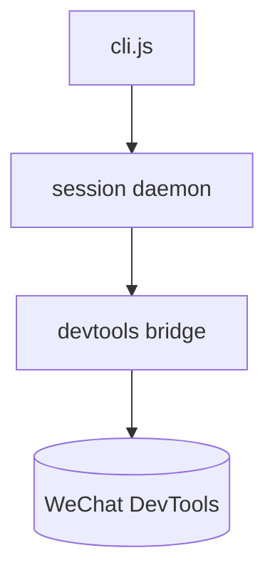
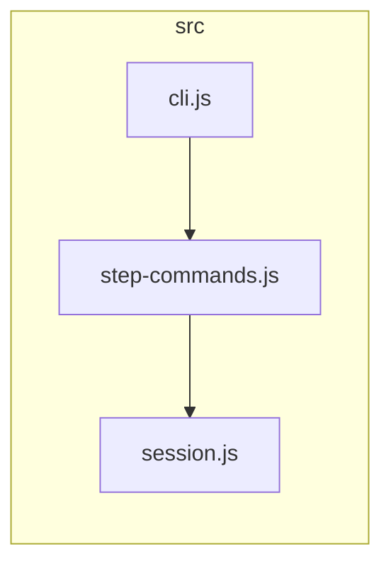

# Contract format (what the gate parses)

The three artifacts are human-facing Markdown. Only `interfaces.md` has a **strict,
gate-parseable** shape — `scripts/verify_contracts.mjs` reads it. `architecture.md`
and `structure.md` are prose + Mermaid; the gate does not parse them, the
fresh-reader pass checks them.

## `interfaces.md` — gate-parseable

A `## Public interface` table, one row per public symbol, exactly three columns:

```markdown
## Public interface

| Symbol | Signature | Source |
|---|---|---|
| `parseConfig` | `parseConfig(text: string): Config` | `src/config.js:12` |
| `loadEnv`     | `loadEnv(): Env`                     | `src/env.js:5`    |
```

- **Symbol** — the exact public identifier, backticked. Matched by exact name (so
  `id` is never confused with `uuid`/`idx`). When the same name is exported from two
  files (two packages' `apply`, two controllers' `create`), those are two symbols:
  give each its own row citing its own file, or exclude it. A re-export needs no
  second row: an ESM barrel (`export { x } from './x'`), a CommonJS barrel
  (`exports.x = require('./x')`, `module.exports = { x }`), or a `.d.ts` beside its source.
- **Signature** — human-facing; the gate does not check it (the fresh-reader pass
  does). Keep it real.
- **Source** — `path:line`, backticked, **relative to the project root** (or to the
  `--scope` dir), pointing at the definition line. The gate fails if the symbol is
  not defined there.

### Intentionally-internal exclusions

A symbol the extractor sees as public-looking but that is deliberately **not** part
of the contract goes under:

```markdown
## Intentionally internal (excluded from coverage)

- `legacyShim` — kept for one release; not a supported interface
- `debugDump`  — diagnostics only
```

Rules (see `references/gate-design.md`):
- A **strongly-exported** symbol (`export function …`, `module.exports.x`, top-level
  `def`/`class`, exported Go func, `public` member) may be listed intentionally
  internal **only with a same-line reason** — why it is not a public interface. A
  fresh reader then verifies the reason against the code (exclusion card,
  `references/protocol.md`); the gate itself does not judge it.
- **Reason grammar** (what the gate checks — presence, never quality): the text after
  the closing backtick of the first backticked identifier on the list-item line, with
  leading whitespace and separators (`—` `–` `-` `:` `：` `,` `，` `(` `（`) stripped.
  A reason is present iff at least one letter remains (CJK counts). Separator-only,
  whitespace-only, or a reason written only on a continuation line = no reason →
  `FLAG [EXCLUSION_NEEDS_REASON]` (deliberately loud). One exclusion per line.
- Weak (unexported, ambiguous) surface needs no reason. A symbol whose name starts
  with `_` is private by convention and never part of the surface.
- Any heading containing "internal" makes its bullets exclusions — keep backticked
  bullets out of headings like `## Internal architecture`.

## `architecture.md` — Mermaid conventions

Lead with a `flowchart`/`graph` of components and their dependencies, then prose:

```markdown
# Architecture



## Components
- **cli.js** — argument parsing + command dispatch. Owns: …
…
## Boundaries
- The bridge is the only component that talks to DevTools; …
```

## `structure.md` — Mermaid + module map

A diagram of how files/modules are organized, then a table:

```markdown
# Structure



| Module | Responsibility | Depends on |
|---|---|---|
| `src/cli.js` | entry + dispatch | `step-commands.js` |
…
```

Keep diagrams **diffable** (Mermaid text, not images) so the contract reviews like
code.
